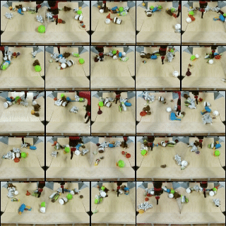

<div align="center">    

## Video Diffusion Models with Local-Global Context Guidance
</div>

<h3 align="center">IJCAI 2023, <a href="https://arxiv.org/abs/2306.02562" target="_blank">Paper</a> </h3>

## Table of Contents

- [Table of Contents](#table-of-contents)
- [Overview](#overview)
  * [Abstract](#abstract)
  * [Method](#method)
  * [Examples](#examples)
- [Running the code](#running-the-code)
  * [installation](#Installation)
  * [Data preparation](#Data)
  * [Training](#Training)
  * [Sampling](#sampling)
  * [Metric](#Calculate-Metric)
- [Acknowledgement](#acknowledgement)
- [Citation](#citation)


## Overview

### Abstract
Diffusion models have emerged as a powerful paradigm in video synthesis tasks including prediction, generation, and interpolation. Due to the limitation of the computational budget, existing methods usually implement conditional diffusion models with an autoregressive inference pipeline, in which the future fragment is predicted based on the distribution of adjacent past frames. However, only the conditions from a few previous frames can't capture the global temporal coherence, leading to inconsistent or even outrageous results in long-term video prediction.  
In this paper, we propose a Local-Global Context guided Video Diffusion model (LGC-VD) to capture multi-perception conditions for producing high-quality videos in both conditional/unconditional settings. In LGC-VD, the UNet is implemented with stacked residual blocks with self-attention units, avoiding the undesirable computational cost in 3D Conv. We construct a local-global context guidance strategy to capture the multi-perceptual embedding of the past fragment to boost the consistency of future prediction. Furthermore, we propose a two-stage training strategy to alleviate the effect of noisy frames for more stable predictions. Our experiments demonstrate that the proposed method achieves favorable performance on video prediction, interpolation, and unconditional video generation. 
### Method
<div align=center></div>

### EXamples
#### Prediciton results on Cityscapes
<div align=center></div>

From top to bottom: Ground Truth (Top Row), MCVD spatin (Second Row), MCVD concat (Third Row), Our Method (Bottom Row).
#### Prediciton results on BAIR
<div align=center></div>

From top to bottom: Ground Truth (Top Row), MCVD spatin (Second Row), MCVD concat (Third Row), Our Method (Bottom Row).
#### unconditional generation results on BAIR
<div align=center></div>

Our unconditional generation results on BAIR.
#### video infilling results on BAIR
<div align=center></div>

Our video infilling results on BAIR.

## Running the code
### Installation
```
conda create -n lgc_vd python=3.8
pip install -r requirements.txt
```
### Data 
You can handle the dataset in the following way, or you can directly download the preprocessed dataset from https://github.com/voletiv/mcvd-pytorch.
#### Cityscapes
1. Download Cityscapes video dataset (`leftImg8bit_sequence_trainvaltest.zip` (324GB)) from  https://www.cityscapes-dataset.com/
2. Convert it to HDF5 format, and save in `/path/to/Cityscape_hdf5`:
`python datasets/cityscapes_convert.py --leftImg8bit_sequence_dir '/path/to/Cityscapes/leftImg8bit_sequence' --image_size 128 --out_dir '/path/to/Cityscapes_hdf5'`

#### BAIR
1. Download BAIR video dataset (`BAIR Robot Pushing Dataset (low resolution)`) from  https://sites.google.com/berkeley.edu/robotic-interaction-datasets
2. Convert it to HDF5 format, and save in `/path/to/BAIR_hdf5`:
`python datasets/bair_convert.py --bair_dir '/path/to/bair' --out_dir '/path/to/bair_hdf5'`

### Training
You can train on Cityscapes with 4 GPUs using:
```
python main.py --config configs/cityscape.yml
```
### Sampling
The pretrained checktpoints can be found here: https://drive.google.com/file/d/1cAJVaRaJORPR2b4OH_9D4gbAWBXmqWCK/view?usp=drive_link  
You can change the task in `cityscape_test.yml`, and the optional tasks include video prediction, video interpolation and video generation.
```
python main.py --config configs/cityscape_test.yml
```

### Calculate-Metric
The code will calculate PSNR, SSIM, LPIPS and FVD.

```
python eva.py 
```
## Acknowledgement
Our work is based on https://github.com/lucidrains/denoising-diffusion-pytorch

## Citation
If you find this project helpful for your research, please consider citing the following BibTeX entry.
```BibTex
@misc{yang2023video,
      title={Video Diffusion Models with Local-Global Context Guidance}, 
      author={Siyuan Yang and Lu Zhang and Yu Liu and Zhizhuo Jiang and You He},
      year={2023},
      eprint={2306.02562},
      archivePrefix={arXiv},
      primaryClass={cs.CV}
}
```
